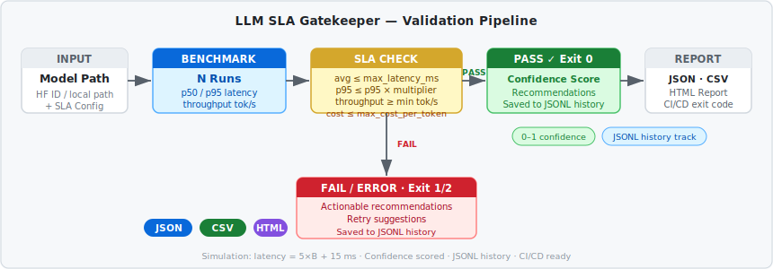
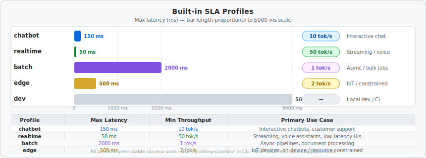

# LLM SLA Gatekeeper — Automated Deployment Gating for LLMs

> *Made autonomously using [NEO](https://heyneo.so) · [](https://marketplace.visualstudio.com/items?itemName=NeoResearchInc.heyneo)*


**Block bad model deploys before they hit production — latency benchmarks, SLA profiles, confidence scoring, and CI/CD-ready exit codes.**

LLM SLA Gatekeeper is an automated deployment gating tool that validates whether a language model meets measurable SLA thresholds (latency, throughput, cost) before it hits production. It runs benchmarks against configurable targets and returns a deterministic **GO / NO-GO** verdict with a confidence score, actionable recommendations, and structured output in JSON, CSV, or HTML.

---

## How It Works



The pipeline is straightforward and fully deterministic:

1. **Input** — Provide a Hugging Face model ID or local path, along with an SLA config (max latency, min throughput, max cost per token).
2. **Benchmark** — The validator runs `N` inference passes, recording per-token latency samples. It computes p50, p95, average latency, and throughput.
3. **SLA Check** — Results are compared against configured thresholds: average latency ≤ `max_latency_ms`, p95 ≤ `max_latency_ms × p95_multiplier`, and throughput ≥ `min_throughput_tokens_per_sec`.
4. **Verdict** — A `PASS` (exit 0) or `FAIL` (exit 1) is issued, accompanied by a 0–1 confidence score and recommendations. All results are appended to a JSONL history file for regression tracking. Errors produce exit 2.

Report output is written to JSON, CSV, and/or HTML as configured.

---

## Install

```bash
git clone https://github.com/your-org/llm-sla-gatekeeper.git
cd llm-sla-gatekeeper
pip install -r requirements.txt
```

**Requirements** — Python 3.8+, NumPy, PyTorch, Transformers, Gradio. All listed in `requirements.txt`.

For simulation-only use (no GPU, no model download), no additional setup is required — just set `SLA_SIMULATION_MODE=1` or pass `--simulate`.

---

## Quickstart

### Python API

```python
from llm_sla_gatekeeper import validate_model, profile_to_sla_config, SLAValidator, SLAConfig

# Simple one-liner — run in simulation mode (no GPU/download required)
result = validate_model("Qwen/Qwen3-8B", max_latency_ms=200, force_simulation=True)
print(result.status)               # "PASS" or "FAIL"
print(result.benchmark.avg_latency_ms)
print(result.confidence_score)     # 0.0–1.0

# Using a named profile
sla = profile_to_sla_config("chatbot")
validator = SLAValidator(force_simulation=True)
result = validator.validate("Qwen/Qwen3-8B", sla)
print(result.status)
print(result.recommendations)

# Batch validation — compare multiple models against the same SLA
results = validator.validate_batch(["Qwen/Qwen3-8B", "Qwen/Qwen3-1.7B"], sla)
for r in results:
    print(f"{r.model_id}: {r.status} (confidence={r.confidence_score:.2f})")
```

### History API

```python
from llm_sla_gatekeeper import history_summary, load_history

summary = history_summary()
# {"total": 42, "pass_count": 38, "fail_count": 3, "error_count": 1, "models_seen": 7}

records = load_history(limit=50)  # list of ValidationResult dicts, newest first
```

---

## CLI

All validation functionality is available via `run_validation.py`:

```bash
# Basic — validate a single model against a latency target
python run_validation.py --model=Qwen/Qwen3-8B --slatarget=200ms

# Use a named SLA profile
python run_validation.py --model=Qwen/Qwen3-8B --profile=chatbot --simulate

# Batch mode — validate multiple models at once
python run_validation.py --batch="Qwen/Qwen3-8B,Qwen/Qwen3-1.7B" --profile=edge --simulate

# Show history summary
python run_validation.py --history

# Save structured output
python run_validation.py --model=Qwen/Qwen3-8B --slatarget=300ms --output=result.json
python run_validation.py --model=Qwen/Qwen3-8B --profile=realtime --output-format=both

# Launch Gradio Web UI
python app.py
```

### All CLI Flags

| Flag | Default | Description |
|---|---|---|
| `--model` | `$SLA_MODEL_PATH` | Hugging Face model ID or local path |
| `--batch` | — | Comma-separated list of model IDs for batch validation |
| `--slatarget` | `200ms` | Max latency, e.g. `150ms` or `300ms` |
| `--profile` | — | Named profile: `chatbot`, `realtime`, `batch`, `edge`, `dev` |
| `--throughput` | — | Minimum throughput in tok/s |
| `--cost` | — | Maximum cost per token in USD |
| `--config` | — | Path to JSON config file |
| `--runs` | `5` | Number of benchmark runs |
| `--tokens` | `50` | Tokens to generate per run |
| `--output` | — | Output file path |
| `--output-format` | `json` | `json`, `csv`, or `both` |
| `--history` | — | Print history summary and exit |
| `--simulate` | — | Force simulation mode |
| `--verbose` | — | Verbose logging |
| `--ui` | — | Launch Gradio UI instead of running CLI |

---

## SLA Profiles



Five named profiles cover the most common LLM deployment scenarios. Each profile sets a max latency, minimum throughput, and is tuned for a specific use case.

| Profile | Max Latency | Min Throughput | Use Case |
|---|---|---|---|
| `chatbot` | 150 ms | 10 tok/s | Interactive chatbots, customer support |
| `realtime` | 50 ms | 50 tok/s | Streaming, voice assistants, low-latency UIs |
| `batch` | 2000 ms | 1 tok/s | Async pipelines, document processing, summarization |
| `edge` | 500 ms | 2 tok/s | IoT, on-device inference, resource-constrained environments |
| `dev` | 5000 ms | — | Local development, CI/CD dry runs, pre-commit gates |

All profile thresholds are overridable via environment variables (see [Environment Variables](#environment-variables)).

```bash
python run_validation.py --model=Qwen/Qwen3-8B --profile=chatbot --simulate
python run_validation.py --model=Qwen/Qwen3-8B --profile=realtime --simulate
```

---

## Gradio Web UI

```bash
python app.py
# → http://localhost:7860
```

The web UI provides four tabs:

| Tab | Description |
|---|---|
| **Validate** | Run a single model validation with configurable profile, latency target, and simulation toggle. Live results with confidence score and recommendations. |
| **Compare** | Batch validation — enter a comma-separated list of models and compare them side by side against the same SLA profile. |
| **History** | Browse the full JSONL validation history, filter by model or status, and review trend data. |
| **About** | Documentation, formula reference, environment variable guide, and profile details. |

Configure the server via environment variables:

```bash
GRADIO_SERVER_NAME=0.0.0.0 GRADIO_SERVER_PORT=7860 GRADIO_SHARE=false python app.py
```

---

## Confidence Scoring

Every validation result includes a `confidence_score` between 0.0 and 1.0 that reflects how trustworthy the verdict is given the number of benchmark runs and the variance observed.

**Formula:**

```
run_score   = min(n / 20.0, 1.0)                   # saturates at 20 runs
var_score   = max(0.0, 1.0 - (std / mean) × 2)     # penalizes high variance
mode_factor = 1.0   (real hardware)
            | 0.75  (simulation mode)

confidence  = min(1.0, (run_score × 0.5 + var_score × 0.5) × mode_factor)
```

**Interpreting scores:**

| Score | Meaning |
|---|---|
| 0.90–1.00 | High confidence — stable results over many runs |
| 0.70–0.89 | Good confidence — minor variance or fewer runs |
| 0.50–0.69 | Moderate confidence — consider increasing run count |
| < 0.50 | Low confidence — high variance or very few runs |

Simulation mode caps confidence at 0.75 to reflect that synthetic latency figures are estimates. Increase `--runs` or `SLA_BENCH_RUNS` to raise the score.

---

## Simulation Mode

When a GPU or model download is not available, simulation mode generates synthetic benchmark data using a linear formula based on model size:

```
latency_ms = 5 × model_size_in_B + 15
```

For example, a 7B-parameter model yields `5 × 7 + 15 = 50 ms` simulated latency. A 1.7B model yields `5 × 1.7 + 15 = 23.5 ms`.

**Enable simulation:**

```bash
# Via environment variable
SLA_SIMULATION_MODE=1 python run_validation.py --model=Qwen/Qwen3-8B --profile=chatbot

# Via CLI flag
python run_validation.py --model=Qwen/Qwen3-8B --profile=chatbot --simulate

# Via Python API
result = validate_model("Qwen/Qwen3-8B", max_latency_ms=200, force_simulation=True)
```

**CI/CD integration** — simulation mode makes it practical to gate PRs or nightly builds without GPU runners:

```yaml
# .github/workflows/sla-gate.yml
- name: SLA Gate
  run: |
    SLA_SIMULATION_MODE=1 python run_validation.py \
      --model=Qwen/Qwen3-8B \
      --profile=chatbot \
      --output=sla-result.json
  # Exit code 0 = PASS, 1 = FAIL, 2 = ERROR
```

The deterministic exit codes (`0`, `1`, `2`) make it trivial to block merges or deployments on SLA failures.

---

## History & Regression Tracking

Every validation run (pass, fail, or error) is appended to a JSONL file at `outputs/history.jsonl`. This enables longitudinal tracking of model performance across code changes, hardware upgrades, and model updates.

```python
from llm_sla_gatekeeper import history_summary, load_history

# Aggregated statistics
summary = history_summary()
# {
#   "total": 42,
#   "pass_count": 38,
#   "fail_count": 3,
#   "error_count": 1,
#   "models_seen": 7
# }

# Load raw records (newest first)
records = load_history(limit=50)
for r in records:
    print(r["model_id"], r["status"], r["timestamp"])
```

**JSONL format** — each line is a JSON object with:

```json
{
  "model_id": "Qwen/Qwen3-8B",
  "status": "PASS",
  "timestamp": "2026-03-27T12:00:00Z",
  "avg_latency_ms": 48.2,
  "p95_latency_ms": 61.4,
  "throughput_tokens_per_sec": 12.3,
  "confidence_score": 0.81,
  "simulated": false,
  "profile": "chatbot"
}
```

Configure the history file location with `SLA_HISTORY_FILE`.

---

## Environment Variables

| Variable | Default | Description |
|---|---|---|
| `SLA_MODEL_PATH` | `Qwen/Qwen2.5-7B-Instruct` | Default model to validate |
| `SLA_MAX_LATENCY_MS` | `200` | Default max latency threshold (ms) |
| `SLA_COST_PER_TOKEN_USD` | `0` | Max cost per token in USD (0 = disabled) |
| `SLA_P95_MULTIPLIER` | `1.5` | Multiplier applied to max latency for p95 check |
| `SLA_BENCHMARK_TOKENS` | `50` | Tokens to generate per benchmark run |
| `SLA_WARMUP_RUNS` | `2` | Warm-up runs before measurement |
| `SLA_BENCH_RUNS` | `5` | Number of measured benchmark runs |
| `SLA_BENCH_MAX_RETRIES` | `2` | Max retries on transient benchmark errors |
| `SLA_SIMULATION_MODE` | — | Set to `1` to enable simulation mode |
| `SLA_OUTPUTS_DIR` | `outputs` | Directory for report output files |
| `SLA_HISTORY_FILE` | `outputs/history.jsonl` | Path to JSONL history file |
| `LOG_LEVEL` | `INFO` | Logging verbosity (`DEBUG`, `INFO`, `WARNING`, `ERROR`) |
| **Profile overrides** | | |
| `SLA_PROFILE_CHATBOT_LATENCY_MS` | `150` | chatbot profile max latency |
| `SLA_PROFILE_CHATBOT_THROUGHPUT` | `10` | chatbot profile min throughput (tok/s) |
| `SLA_PROFILE_REALTIME_LATENCY_MS` | `50` | realtime profile max latency |
| `SLA_PROFILE_REALTIME_THROUGHPUT` | `50` | realtime profile min throughput (tok/s) |
| `SLA_PROFILE_BATCH_LATENCY_MS` | `2000` | batch profile max latency |
| `SLA_PROFILE_BATCH_THROUGHPUT` | `1` | batch profile min throughput (tok/s) |
| `SLA_PROFILE_EDGE_LATENCY_MS` | `500` | edge profile max latency |
| `SLA_PROFILE_EDGE_THROUGHPUT` | `2` | edge profile min throughput (tok/s) |
| `SLA_PROFILE_DEV_LATENCY_MS` | `5000` | dev profile max latency |
| **Gradio** | | |
| `GRADIO_SERVER_NAME` | `0.0.0.0` | Gradio bind address |
| `GRADIO_SERVER_PORT` | `7860` | Gradio port |
| `GRADIO_SHARE` | `false` | Create public Gradio share link |

---

## Run Tests

```bash
# Run all 134 tests
python -m pytest tests/ -v

# Run with simulation mode (no GPU required)
SLA_SIMULATION_MODE=1 python -m pytest tests/ -v

# Run a specific test file
python -m pytest tests/test_sla_validator.py -v
```

All tests pass without a GPU — the test suite uses simulation mode and mocked inference where needed.

---

## Output Formats

### JSON

```bash
python run_validation.py --model=Qwen/Qwen3-8B --profile=chatbot --output=result.json
```

Produces a structured JSON file with full benchmark metrics, SLA config, verdict, confidence score, and recommendations.

### CSV

```bash
python run_validation.py --model=Qwen/Qwen3-8B --profile=chatbot --output-format=csv
```

Suitable for spreadsheet analysis or batch comparison imports.

### HTML Report

```bash
python run_validation.py --model=Qwen/Qwen3-8B --profile=chatbot --output-format=both
```

Produces a self-contained HTML report with formatted tables, color-coded verdicts, and metric summaries. Ideal for sharing with non-technical stakeholders.

### Exit Codes

| Code | Meaning | When to expect it |
|---|---|---|
| `0` | **PASS** | All SLA thresholds met |
| `1` | **FAIL** | One or more thresholds violated |
| `2` | **ERROR** | Benchmark failed to run (model load error, timeout, etc.) |

These codes integrate cleanly with CI/CD pipelines, pre-commit hooks, and deployment scripts.

---

## Compared to Other Tools

| | LLM SLA Gatekeeper | MLflow | Weights & Biases | Manual checks |
|---|---|---|---|---|
| **Latency benchmarking** | Yes — p50/p95/avg | No | No | Error-prone |
| **Throughput validation** | Yes | No | No | No |
| **Named SLA profiles** | 5 built-in | No | No | No |
| **Confidence scoring** | Yes (0–1) | No | No | No |
| **Simulation mode** | Yes | No | No | N/A |
| **CI/CD exit codes** | 0/1/2 | No | No | No |
| **JSONL history** | Yes | Experiment tracking | Run tracking | No |
| **No GPU required** | Yes (simulation) | Yes | Yes | Depends |
| **HTML/JSON/CSV reports** | Yes | Yes | Yes | No |
| **Gradio UI** | Yes | No | No | No |
| **Python API** | Yes | Yes | Yes | No |

MLflow and W&B excel at experiment tracking across training runs. LLM SLA Gatekeeper is purpose-built for the **deployment gate** step: answering "is this model fast enough and cheap enough to serve in production right now?" with a single, auditable, repeatable verdict.

---

## Project Structure

```
llm-sla-gatekeeper/
├── llm_sla_gatekeeper/
│   ├── __init__.py          # Public API exports
│   ├── sla_validator.py     # SLAValidator, SLAConfig, ValidationResult
│   ├── sla_profiles.py      # Named profile definitions
│   ├── benchmark.py         # BenchmarkResult, TokenLatencySample
│   ├── history.py           # JSONL history tracking
│   └── hardware_info.py     # Device detection (GPU/CPU)
├── app.py                   # Gradio Web UI (4 tabs)
├── run_validation.py        # CLI entry point
├── examples/                # 4 runnable example scripts
├── tests/                   # 134 tests (pytest)
├── outputs/                 # Default output directory (gitignored)
├── assets/
│   ├── validation-flow.svg  # Pipeline diagram
│   └── profiles.svg         # SLA profiles chart
└── requirements.txt
```

---

## License

MIT — see `LICENSE` for details.
